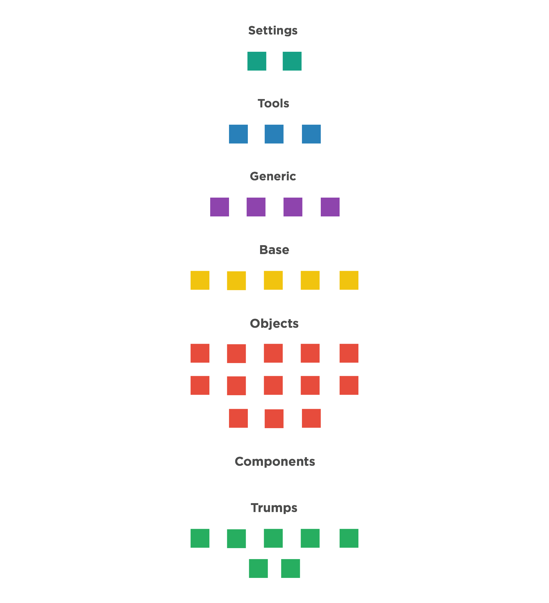

<!--TOC-->
# What is Aleut CSS?
Aleut is a fork of [inuitcss](https://github.com/inuitcss). It is a powerful framework designed with scalability and performance in mind. Inuit was left alone a little too long, so we made a more opinionated version with a lot of the ideas proposed by Harry Roberts, easier variable-names and fewer choices. If you are used to inuitcss, aleutcss should be more or less plug and play. If you wonder what this is and how you can use it, please read on.

## "Let me just try this thing"

>	tl;dr. Download the starter. Uncomment some of the imports under _objects_ and set the varibles to `true`. Run `npm start` in the command line and open [localhost:5000](http://localhost:5000) in the browser. 

You _could_ download all the packages from Github in zip-files, but that'd make it pretty unmaintainable. Aleut is distributed with [node package manager](https://npmjs.com), which makes installing it in a project easy as a breeze. If you're not familiar with the `npm` tool in the command line, do yourself a huge favor and [familiarize yourself with it](https://docs.npmjs.com/getting-started/what-is-npm). You'll thank us later.

Aleut is built with [SASS](http://sass-lang.com/guide). Chance is that you're already familiar with how SASS works. If not, Aleut is a great way to start learning. We'll cover how you import the packages into your stylesheet, and how to build the CSS-files for your web project.

### Aleut from scratch


We have made a starter package that includes all the starter packages. It should be enough to get you going.

If you're starting a new project from scratch it's easiest to just download [the zip-file](https://github.com/mhauken/start/archive/master.zip) directly. You can also do it all from the command line:


~~~ssh
# Download or clone the starter package and save it as a project dependency
$ wget https://github.com/aleutcss/starter/archive/master.zip
# Unzip the zip file
$ unzip master.zip
# Navigate into the starter folder
$ cd starter
# Download all the project dependencies with npm
$ npm i
~~~


[Proceed to the next step](#ive-got-all-the-packages-and-settingsscss-now-what)


### Getting Aleut into an existing project

If you already have a `package.json`-file in your project, just run this command in terminal to save the Aleut essentials as dependencies.


~~~ssh
$ npm install aleutcss/objects.tables aleutcss/objects.pack aleutcss/objects.media aleutcss/objects.list-ui aleutcss/objects.list-inline aleutcss/objects.buttons aleutcss/objects.box aleutcss/objects.block aleutcss/objects.tabs aleutcss/objects.list-bare aleutcss/objects.layout aleutcss/objects.flag aleutcss/utilities.spacing-responsive aleutcss/utilities.spacing aleutcss/utilities.clearfix aleutcss/utilities.paragraphs aleutcss/utilities.headings aleutcss/utilities.print aleutcss/utilities.widths aleutcss/utilities.widths-responsive aleutcss/tools.widths aleutcss/tools.responsive aleutcss/tools.mixins aleutcss/tools.function --save --no-progress
~~~


You will now have a bunch of new stuff in your npm-folder (usually called `node_modules`). That's Aleut ready to do its work. But first you'll have to import them into your sass-project with the sass `@import` function. We have prepared a `style.scss` for you to [download into your scss-folder](https://raw.githubusercontent.com/aleutcss/starter/master/style.scss).

### I've got all the packages and style.scss, now what?

Open and browse through the style.scss file. You'll notice that it has some documentation and a bunch of `@import` tags. If you imported Aleut into an existing project you'll have to make sure that the import path is correct.

~~~ssh
starter
├── node_modules
  ├── base.lists
  ├── base.page
  ├── …
├── components
    ├── compontent.icon.scss
├── style.scss <= $path:"/nodes_modules"
~~~

In an existing project, you'll probably want to keep all the stylesheet files in their own `sass` folder. The path should be set relative to `styles.scss`.


~~~ssh
project-folder
├── node_modules
  ├── base.lists
  ├── base.page
  ├── …
├── sass
  ├── components
    ├── compontent.icon.scss
  ├── style.scss <= $path:"../nodes_modules"
~~~

Similarly, if you prefer to have all vendor packages in one folder, you'll have to set path accordingly.

~~~ssh
project-folder
├── vendors
  ├── bower_components
  ├── node_modules
    ├── base.lists
    ├── base.page
    ├── …
├── sass
  ├── components
    ├── compontent.icon.scss
  ├── style.scss <= $path:"../vendors/nodes_modules"
~~~


Now, go back to `styles.scss`. There's a lot of thinking behind the structure of this file, but for now, the only thing you should now is if you compile this file, you'll get some generic settings and resets. To make use of the objects, you'll have un-comment them. The idea behind this framework is to compile what you use.

Lets say you want to make a small button component. Aleut comes with `objects.buttons` with some predefined rules for how a button element. By importing this file, you can make use of the `o-btn` class, which makes button-objects behave a bit better. It has also some predefined options, which may come in handy. These are turned off by default. To enable them, you'll have to set the variable to `true` _before_ the line, which imports the object.

~~~scss
$o-btn--small: true; // <= overrides $o-btn-small: false !default;
@import "../node_modules/aleut-buttons/objects.buttons.scss";
~~~

The same logic applies to *default values*. If you want to change them, just declare the variable before the `@import` line.

~~~scss
$btn-background:      #BADA55;
$btn-radius:          3px;
$o-btn--full:         true;
@import "node-modules/aleut-buttons/objects.buttons";
~~~

# Getting deep with Aleut.css

## Structure
Aleut.css is based upon 35 different packages loaded in specific layers to remain in control of specificity and structuring your project. The order of partials within each layer is fairly open; it is the sections themselves that are important to get in the correct order.

[Image of all the packages with links to each of them in this document]


### Settings
Global variables, site-wide settings, config switches, etc.
(just code for SCSS)

~~~html
<h4 class="c-toggle u-bg-settings" data-toggle-next> settings.default</h4>
<article class="c-article" data-hide>
  
    
    
  {{ settingsDefault | markdownify }}
</article>
~~~

~~~html
<h4 class="c-toggle u-bg-settings" data-toggle-next> settings.responsive</h4>
<article class="c-article" data-hide>
  
    
    
  {{ settingsResponsive | markdownify }}
</article>
~~~

### Tools
Site-wide mixins and functions.
(just code for SCSS)

### Generic
Low-specificity, far-reaching rulesets (e.g. resets).

### Base
Unclassed HTML elements (e.g. `a {}`, `blockquote {}`, `address {}`).

### Objects (o-prefix on the class-names)
Objects, abstractions, and design patterns (e.g. `.o-media {}`).
This is code that has no visual style and that you can move from project to project.

### Components (c-prefix on the class-names)
Discrete, complete chunks of UI (e.g. `.c-carousel {}`). This is the one layer that aleutcss doesn’t get involved with. The balance between adding objects and components to the same object is the key to understand Aleutcss.

### Utilities (u-prefix on the class-names)
High-specificity, very explicit selectors. Overrides and helper classes (e.g. `.u-hidden {}`) as well as grids.

##

### Modifying aleut
Since all the aleut-files are imported via npm you should not modify the files directly. You should rather edit the variable before you `@import` the specific file. Let's take f.ex. the button-object: If you want to change the default button works you edit it like this:
```css
$btn-background:      #BADA55;
$btn-radius:          3px;
$o-btn--full:         true;
@import "node-modules/aleut-buttons/objects.buttons";
```

It is also important to underline that some times it is more correct to create a new CSS-class as a modifier. See more in [components]("#components")

### Off by default
As you've seen aleut consist of a lot of different files. This is so that you just import the files you need. But we have another layer of reduced bloat: all variants are switched off by default. So if you just want buttons, you don’t get every different size and version of them unless you explicitly turn them on.

To turn features on, just set their switches to true (again, before you @import the file):
```css
$o-btn--full:    true;
@import "node-modules/aleut-buttons/objects.buttons";
```

### Extending aleut
Another good thing about the structure of aleut and it's packages is that you can add your own functionality in and around aleuts code. By doing this you can grow your codebase in any direction and create your own partials and objects as long as you follow the same structure.

To extend aleut, simply create a partial in the `<section>.<file>` format as the rest of the files, and `@import ` it wherever it is needed.

### Components
Aleut does its best to stay away from any cosmetic styling. You can therefore use it on any project without the same look-and-feel. If you do require a UI out of the box, then inuitcss is probably not the best tool for you.

Because aleut does no cosmetic styling, it is up to you to author the Components layer. A good example of this could be a main navigation of a site. First you mark it up as an `<ul>`, then you add the object `.o-list-inline` to make the menu horizontal, to style it to your liking you create a new file called `_components.site-nav.scss` and add the class `.c-site-nav` to the `.o-list-inline` and style it to your liking.

## Getting started
If it's your first time with aleut we recommend starting with our kitchensink-project (where everything is still off by default), where we import all the packages automatically.
